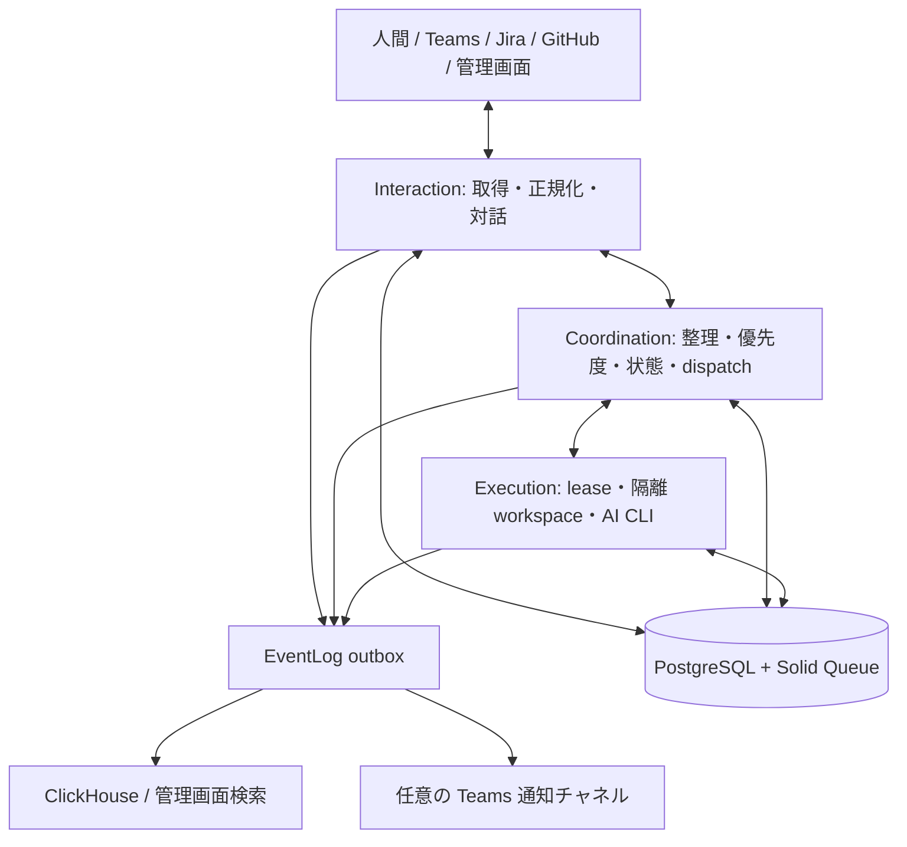

# AI エンジニア基盤

## 目的と境界

Web とバックグラウンドワーカーは PostgreSQL を共有する。Solid Queue も同じデータベースに配置する。状態を持つ Rails の制御処理と、CLI を呼び出す実行処理を1つの常駐ワーカーで動かす。1 利用環境は専用 DB（非特権 login role）+ Web / execution の2サービスが単位であり、同一環境の Web replica とは区別する。共有サーバー上の複数利用環境は同一 Railway environment に置く。詳細は [Railway 複数利用環境の運用](railway-environments.md)。



Interaction はプラグインを使いイベント取得と外部投稿を行う。人間が送るメッセージはデータであり、システム設定・ツール権限・直接的なワーカー命令にはならない。Coordination だけがタスクの作成、優先度、状態遷移、実行依頼を決める。Execution は永続化された依頼と lease を取得して仕事を行い、構造化した結果を返す。Execution から外部プラグインを呼び出さない。

AI の自然言語指示は業務判断を補助する。スコープ・状態遷移・環境変数・タイムアウト・入出力スキーマは Ruby の決定的な検証で強制する。

## 技術構成

- Ruby 3.4.9、Rails 8、PostgreSQL、Solid Queue、Puma、ERB/CSS。
- JSON Schema 検証は `json_schemer`。単体・結合テストは Smartest。
- EventLog の検索用保存先は ClickHouse 26.8 系。PostgreSQL に残るのは配信待ちとリトライ状態で、永続ログアーカイブではない。
- Docker Compose は web/unified execution worker/postgres/clickhouse。Railway も同じ分割。ngrok は必要時のみ。
- コンテナイメージは役割別: `app`（web / migrate / clickhouse-init 固定。AI CLI なし）と `ai`（execution の既定。Claude / Codex / Muse 同梱。Muse は公式公開 Linux バイナリを固定バージョン・SHA256 検証で取得し、ビルド時ログイン不要）。Railway は `RUNTIME_TARGET`（既定 `app`、worker は `ai`）で同じ分離を行う。未設定 provider は選択可・実行時失敗が契約。
- GitHub Actions を使う場合は CI だけとする。

## 永続モデル

| モデル | 主な情報 / 制約 |
| --- | --- |
| ExternalEvent | plugin、event_id、fingerprint、resource_id、actor、occurred_at、payload、processed_at、source_fingerprint / source_updated_at。plugin+event_id+fingerprint を一意にし、親スナップショットは改訂を鎖状に識別する |
| TaskRequest | 管理画面・管理APIの依頼受付。公開UUID、UI/API別の冪等キー、title/description、固有のExternalEventへの参照。受付とイベントを同じtransactionで保存する |
| IntegrationCursor | plugin と scope ごとの cursor JSON、lease、last_polled_at、error。全ページの durable ingest 完了後のみ更新 |
| Task | title、description、status、priority、source reference、next_action_at、lock_version、coordination_result、delivery_batch_key。状態更新は Coordination のみ |
| TaskFeedback | task、body、author、processed_at。人間の意見を保持し、直接的な状態変更をしない |
| TaskRun | task、provider/model/effort/instructions snapshot、status、lease token/expiry、result、error、開始/終了時刻 |
| LayerPolicy | layer（interaction/coordination/execution）、provider（claude/codex/muse）、model、effort、instructions、enabled。layer一意 |
| OutboundAction | plugin、operation、validated input、idempotency key、status、external_id、attempts、error、delivery_batch_key。Coordination が作り Interaction が送る |
| OauthConnection | provider ごとの委任接続1件。世代・外部principal・tenant/cloud・付与scope・状態・期限・安全な分類コード。token は専用 salt の認証付き暗号化のみ。provider 一意 |
| OauthAuthAttempt | 短 TTL の認証試行。state は SHA256 digest のみ保持しブラウザ session に結合。code 保持なし、PKCE verifier（Microsoft のみ）は暗号化。一回消費、state_digest 一意 |
| EventDelivery | redacted envelope、event_id、宛先別配信/再試行状態。配信済みの短期 retention |

Task 状態は `inbox`, `ready`, `running`, `waiting_human`, `waiting_review`, `waiting_delivery`, `done`, `failed`, `cancelled`。priority は大きい値を優先。未定義の遷移を拒否し、row lock と fencing token により古い実行結果が最新状態を上書きしない。AI 呼出しの間に DB transaction を維持しない。

管理画面・管理API 起点の cross-connector 要求（issue #11）は、Task に関連付けられた永続化済みの人間 `admin.task_request` イベントで出所を確認する。source 文字列や AI が返す属性だけでは権限を与えない。Coordination は Interaction の型付き読み取りを通して情報を取得し、結果と検証済み書き込みバッチ（`coordination_result` の要約/件数と `delivery_batch_key`）を原子的に永続化する。アクションなしは `done`、アクション付きは `waiting_delivery` とし、後者の確定は Coordination の reconciler のみが行う。全期待アクションが終端状態になるまで待ち、全件 `sent` なら `done`、`failed` / `uncertain` があれば `waiting_human` にする。欠損・件数不一致は成功扱いにしない。Interaction は Task のライフサイクルを更新せず、Execution はこの読み取り・通知経路には不要。

5 分 polling、滞留 inbox の再処理、実行 lease 回復、EventLog outbox 配信、outbound action 配信は再起動後も続けられる recurring jobs とする。単一ワーカー内で control / execution / `ai_auth_execution` の pool を分け、長い実作業やログインが control の実行枠を消費しないようにする。更新イベントは ID だけでなく fingerprint を持ち、同じメッセージの編集を区別する。

## Ruby ポート契約

pure Ruby のルートは `lib/aiconshell/plugins.rb`, `lib/aiconshell/ai.rb`, `lib/aiconshell/observability.rb`。Rails の root namespace は `Aiconshell`。autoload と明示 require を混在させて定数を重複定義しない。下記の keyword と JSON shape を並列レーンの共通契約とする。必要な変更はこの文書へ反映する。

### Plugins

```ruby
registry = Aiconshell::Plugins::Registry.default
registry.catalog # Array<Hash>: id, operations with input_schema/output_schema/read_only, required_env, configured
registry.invoke(plugin: "github", operation: "latest_events",
                input: { "scope" => "owner/repo", "cursor" => nil },
                context: { "scopes" => ["github:read"] })
```

`context` は信頼できるアプリケーション側で構築し、operation の permission 配列を渡す。宛先の allowlist は Interaction が別途検証し、ユーザー入力から権限を構築しない。operation は原則 `latest_events`, `reply`, `create_issue`。Teams は `send_message` / `reply` を持ち、`create_issue` は非対応として catalog で表す。GitHub は `list_issues` も持つ。operation の `read_only` は既定 `false` で、型付きクエリは明示的な `true` のみを許可する。

`latest_events` の入力: `{"scope": "...", "cursor": null または object}`。
返却: `{"events": [...], "cursor": object}`。
各 event: `event_id`, `fingerprint`, `event_type`, `resource_id`, `actor_id`, `actor_type`（human/bot/system）, `occurred_at`（ISO8601）, `payload`（object）。event_id は plugin 内で安定一意。payload の本文は信頼しない。

`reply` の入力: `{"resource_id": "...", "body": "..."}`。
`create_issue` の入力: `{"scope": "...", "title": "...", "body": "..."}`。
`send_message` の入力: `{"scope": "...", "body": "..."}`。
書込結果: `{"external_id": "...", "url": null または string}`。

HTTP/env/clock は inject 可能。input/output 両方を毎回スキーマ検証。秘密は ENV または private ファイルから読む。catalog は値を表示しない。プラグイン登録は信頼されたコードのみ。MCP wire protocol の互換サーバーは初期スコープに含めない。

`Registry#validate_input(plugin:, operation:, input:, context:)` は `invoke` と同じスキーマ・permission・意味検証を副作用なしで行う。プラグインの任意拡張 `validate_operation_input(operation, input)` は純粋な検証に限定し、HTTP・認証情報読み取り・DB・可変なアプリ状態を参照しない。未実装時はスキーマ検証だけを行う。Coordination はこれを通して全提案を先に検証できる。Outbound 配信は正確な登録済み入出力スキーマを検証し、カスタム必須フィールドを保持する。

GitHub は App installation token、Jira は service account、Teams は Graph read + Bot proactive write。戻り cursor/next link の host を検証する。各 plugin README に最小権限、env 名、paging・retry・送信の制約を記す。

ユーザー委任 OAuth（Atlassian / Microsoft の同意ユーザー）は Task/TaskRun と独立した運用接続であり、[oauth-connections.md](oauth-connections.md) が正とする。接続・試行・世代・秘密なし binding・token 取得の公開契約は `Aiconshell::Oauth::*` と `Oauth::AuthService` / `TokenService` / `CredentialProvider` が担い、Interaction / Coordination / Execution の責務は変えない。この基盤だけでは旧 default registry へ委任 plugin を登録しない（管理画面・adapter・業務統合は後続 Issue）。

### 管理依頼の read / result / receipt

`Coordination::TriageService.new(ai_runner:, registry:, event_sink:, clock:)` に同じ Registry を注入すると、読み取りと結果の検証でその catalog を共有する。AI は次のいずれかを返す。`read_requests` と `rulings` の混在は禁止する。

```json
{"read_requests":[{"task_id":123,"plugin":"github","operation":"list_issues","input":{"scope":"owner/repo"}}]}
```

```json
{"rulings":[{"task_id":123,"result":{"summary":"高優先度の issue が 1 件見つかったため通知を依頼する。","actions":[{"plugin":"teams","operation":"send_message","input":{"scope":"channel:team-id/channel-id","body":"確認が必要な issue があります。"}}]}}]}
```

`Interaction::QueryService` は登録済み read-only operation の正確な入出力スキーマと宛先を検証する。読み取り上限は 3 ラウンド・合計 10 件、同一ラウンド内の Task 重複は禁止。クエリ失敗は内容を含まない分類コードでその処理を終了し、結果保存や通知を行わない。成功した観測は `OBSERVATIONS` JSON として次の AI 呼出しへ渡す。`list_issues` は open issue の 1 ページのみを返し、PR を除外する。`complete` / `next_cursor` / `truncated` / `limit_reached` と各項目の省略フラグを必ず解釈する。ページ数上限では未完了かつ継続 cursor なしとなり、全件確認済みとは扱わない。可変な外部一覧の時点一貫性は保証しない。詳細は [GitHub plugin](../plugins/github/README.md) と [workflow](workflow.md) を参照。

最終 `result` は空白でない 1–2000 文字の要約と最大 20 件の `actions`。`status` / `dispatch` / `reply` / `work_plan` と併用できない。許可される書き込みは `reply` / `create_issue` / `send_message`。未登録 operation、allowlist 外宛先、スキーマ不一致、PostgreSQL に保存できない NUL 文字を拒否する。通常の外部起点 Task は引き続き source に紐付いた legacy `reply` のみを使い、管理依頼用の権限を得ない。

新しい read ラウンドおよび `result` を含む最終ラウンドは、未知・重複 Task 参照を全体として拒否する。結果ラウンドは全提案を検証してから savepoint 内で保存し、途中の拒否で全件を巻き戻す。legacy ruling だけのラウンドは従来どおり個別に適用する。Task version、現在の coordination policy、関連付けられた admin origin を再確認し、適用に成功した snapshot 内の人間フィードバックだけを確認済みにする。

`waiting_delivery` は AI が設定・解除できず、新着フィードバックがあっても triage 対象から除外する。配信中のフィードバックは保存し、reconciler も確認済みにしない。実行中 Task や active/current run を持つ Task への result は拒否する。失敗・不確定な配信は `next_action_at` を消して人間の判断を待ち、勝手に再送しない。再検討には以前の要約と配信先・状態・分類エラーを渡す。`sent` は外部 API の受理を示し、人間の閲覧や外部での exactly-once を保証するものではない。

### AI

```ruby
Aiconshell::Ai::Registry.default.providers
Aiconshell::Ai::Registry.default.configured?("codex")
Aiconshell::Ai::Runner.new.call(
  provider: "codex", prompt: "...", schema: {}, model: nil, effort: nil,
  timeout: 300, workspace: "/controlled/path", layer: "coordination"
) # JSON-compatible Hash, schema validated
```

providers は常に `claude`, `codex`, `muse` を返す。設定診断と選択可能性を分離する。設定されていない provider の policy 保存を拒否しない。未認証、期限切れ、usage limit、CLI 不在は runtime failure として記録する。

CLI 起動は array argv、controlled env、prompt stdin/一時file、bounded output、timeout、process group cleanup。対話・整理用 CLI はツールを禁止または read-only、実行用のみ専用 workspace に書込可能。API key は引き継がない。設定済み subscription auth を private volume から参照し、通常の CLI refresh が永続化できるようにする。アプリ credential と AI auth は別の境界で扱う。

### EventLog

```ruby
Aiconshell::Observability.emit(
  layer: "coordination", kind: "task.prioritized", message: "Priority updated",
  task_id: 123, correlation_id: "uuid", data: { priority: 10 }
)
Aiconshell::Observability.search(
  query: "...", layer: nil, kind: nil, task_id: nil,
  correlation_id: nil, since: nil, until_time: nil, limit: 100
) # Array<Hash>
```

emit は外部ネットワークを同期で呼ばない。失敗によって業務更新を rollback させない。outbox 障害は sanitized local log に記録し、失われ得る条件を説明する。schema validation と redaction は保存前に実施する。AI prompt、raw CLI output、Authorization header、token を記録しない。

ClickHouse と Teams の retry は独立。ClickHouse は event_id で重複を除く。Teams など external API に idempotency 保証がない場合、成功直後の crash 等で exactly-once を保証しないことを記す。配信失敗を EventLog 自身へ無限に再投入しない。

## 管理画面

タスクボード・詳細・実行履歴、フィードバック、レイヤー別 AI policy、プラグイン診断、EventLog の検索、AIアカウント連携。ENV の admin credential で認証し、未設定 production は fail closed。CSRF を維持する。人間が直接 run を作成する API や任意コマンド入力は公開しない。

AIアカウント連携（`/admin/ai_connections`）は業務 Task/TaskRun とは独立した運用管理である。controller は運用サービスへ intent を渡すだけで、業務 worker を直接呼ばず task lifecycle を変えない。接続 snapshot と、認証・状態確認の要求 session を共有 PostgreSQL に持つ。同じ provider/role の同時ログインは partial unique 制約で1件にし、二重 submit は既存 active を返す。job の claim と snapshot の fencing で二重実行と古い上書きを防ぐ。認証 URL/コードは `SECRET_KEY_BASE` 由来キーで暗号化し、終端で削除する。認証 job は単一 execution ワーカー内の別1スレッド pool（`ai_auth_execution`）で処理し、`AICONSHELL_WORKER_ROLE=execution` の一致を検証する。Web に CLI・認証 volume・worker role を付けない。接続 snapshot の execution 一本化と旧 control 認証の失効手順は [AIアカウント連携](ai-connections.md)（#20）が正であり、本書はワーカー配置だけを述べる。

## EventLog 保存先の判断

追記、時間・層・タスクによる絞り込み、長期圧縮と TTL を主な workload とし ClickHouse を採用する。ClickHouse の text index は 26.2 以降で GA。MongoDB は文書単位の更新に便利だが、今回のログ workload では列指向・圧縮・バッチ取込を評価する。実測なしに総合的な速度・費用の優劣は断言しない。日本語検索と少量時の基礎メモリ費用も検証対象。

公式仕様:
- https://clickhouse.com/docs/engines/table-engines/mergetree-family/textindexes
- https://www.mongodb.com/docs/manual/core/indexes/index-types/index-text/
- https://guides.rubyonrails.org/active_job_basics.html
- https://developers.openai.com/codex/auth
- https://code.claude.com/docs/en/cli-reference
- https://smartest-rb.vercel.app/

## 検証と配信

unit suite は fake HTTP/AI/clock/log sink、integration suite は PostgreSQL と ClickHouse。状態遷移、重複イベント、重複 job、古い lease の完了、provider未設定、外部障害、入出力不正、秘密漏えいを検証する。Compose の起動と管理画面を確認し、Railway実デプロイ・実アカウント投稿とは区別して報告する。

Issue #1 設計、#2 Rails、#3 plugins、#4 AI、#5 EventLog、#6 workflow、#7 admin、#8 operations、#9 acceptance。実装は Issue ごとの worktree、独立レーンは並行作業。検収後 main に `--no-ff` merge し、merge message の `closes #N` と push で完了させる。PR は作らない。
