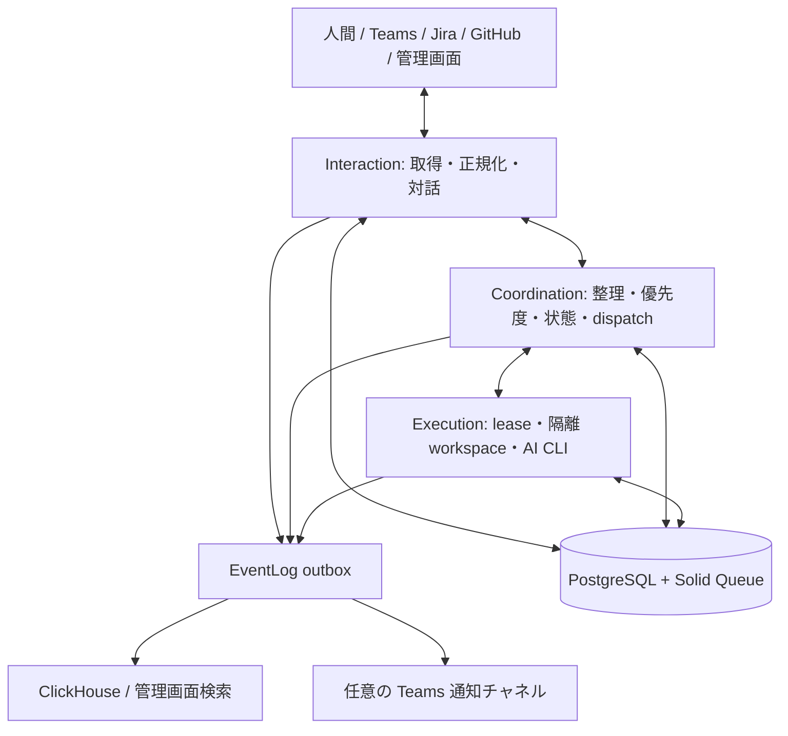

# AI エンジニア基盤

## 目的と境界

Web とバックグラウンドワーカーは PostgreSQL を共有する。Solid Queue も同じデータベースに配置する。状態を持つ Rails の制御処理と、CLI を呼び出す実行処理を常駐コンテナで動かす。



Interaction はプラグインを使いイベント取得と外部投稿を行う。人間が送るメッセージはデータであり、システム設定・ツール権限・直接的なワーカー命令にはならない。Coordination だけがタスクの作成、優先度、状態遷移、実行依頼を決める。Execution は永続化された依頼と lease を取得して仕事を行い、構造化した結果を返す。Execution から外部プラグインを呼び出さない。

AI の自然言語指示は業務判断を補助する。スコープ・状態遷移・環境変数・タイムアウト・入出力スキーマは Ruby の決定的な検証で強制する。

## 技術構成

- Ruby 3.4.9、Rails 8、PostgreSQL、Solid Queue、Puma、ERB/CSS。
- JSON Schema 検証は `json_schemer`。単体・結合テストは Smartest。
- EventLog の検索用保存先は ClickHouse 26.8 系。PostgreSQL に残るのは配信待ちとリトライ状態で、永続ログアーカイブではない。
- Docker Compose は web/control worker/execution worker/postgres/clickhouse。Railway も同じ分割。ngrok は必要時のみ。
- GitHub Actions を使う場合は CI だけとする。

## 永続モデル

| モデル | 主な情報 / 制約 |
| --- | --- |
| ExternalEvent | plugin、event_id、fingerprint、resource_id、actor、occurred_at、payload、processed_at、source_fingerprint / source_updated_at。plugin+event_id+fingerprint を一意にし、親スナップショットは改訂を鎖状に識別する |
| IntegrationCursor | plugin と scope ごとの cursor JSON、lease、last_polled_at、error。全ページの durable ingest 完了後のみ更新 |
| Task | title、description、status、priority、source reference、next_action_at、lock_version、coordination_result、delivery_batch_key。状態更新は Coordination のみ |
| TaskFeedback | task、body、author、processed_at。人間の意見を保持し、直接的な状態変更をしない |
| TaskRun | task、provider/model/effort/instructions snapshot、status、lease token/expiry、result、error、開始/終了時刻 |
| LayerPolicy | layer（interaction/coordination/execution）、provider（claude/codex/muse）、model、effort、instructions、enabled。layer一意 |
| OutboundAction | plugin、operation、validated input、idempotency key、status、external_id、attempts、error、delivery_batch_key。Coordination が作り Interaction が送る |
| EventDelivery | redacted envelope、event_id、宛先別配信/再試行状態。配信済みの短期 retention |

Task 状態は `inbox`, `ready`, `running`, `waiting_human`, `waiting_review`, `waiting_delivery`, `done`, `failed`, `cancelled`。priority は大きい値を優先。未定義の遷移を拒否し、row lock と fencing token により古い実行結果が最新状態を上書きしない。AI 呼出しの間に DB transaction を維持しない。

管理画面起点の cross-connector 要求（issue #11）は、永続化された人間 `admin.task_request` イベントと一致する Task に限り、Coordination が検証済みの書き込みバッチ（`coordination_result` の要約/件数と `delivery_batch_key`）を原子的に永続化する。アクション付きの結果は `waiting_delivery` に遷移し、配信の確定は Coordination の reconciler のみが行う（全件送信で `done`、失敗/不確定の混入で `waiting_human`）。Interaction は Task のライフサイクルを更新しない。Outbound 配信は登録済みプラグインの入出力スキーマを正確に検証し、カスタム必須フィールドを保持する。AI read loop（Triage 拡張）は後続パスで実装する。

5 分 polling、滞留 inbox の再処理、実行 lease 回復、EventLog outbox 配信、outbound action 配信は再起動後も続けられる recurring jobs とする。control と execution の queue を分ける。更新イベントは ID だけでなく fingerprint を持ち、同じメッセージの編集を区別する。

## Ruby ポート契約

pure Ruby のルートは `lib/aiconshell/plugins.rb`, `lib/aiconshell/ai.rb`, `lib/aiconshell/observability.rb`。Rails の root namespace は `Aiconshell`。autoload と明示 require を混在させて定数を重複定義しない。下記の keyword と JSON shape を並列レーンの共通契約とする。必要な変更はこの文書へ反映する。

### Plugins

```ruby
registry = Aiconshell::Plugins::Registry.default
registry.catalog # Array<Hash>: id, operations with input_schema/output_schema, required_env, configured
registry.invoke(plugin: "github", operation: "latest_events", input: {}, context: {})
```

`context` は信頼できるアプリケーション側で構築し、許可 scope 等を渡す。ユーザー入力から無制限に構築しない。operation は原則 `latest_events`, `reply`, `create_issue`。Teams は `send_message` / `reply` を持ち、`create_issue` は非対応として catalog で表す。

`latest_events` の入力: `{"scope": "...", "cursor": null または object}`。
返却: `{"events": [...], "cursor": object}`。
各 event: `event_id`, `fingerprint`, `event_type`, `resource_id`, `actor_id`, `actor_type`（human/bot/system）, `occurred_at`（ISO8601）, `payload`（object）。event_id は plugin 内で安定一意。payload の本文は信頼しない。

`reply` の入力: `{"resource_id": "...", "body": "..."}`。
`create_issue` の入力: `{"scope": "...", "title": "...", "body": "..."}`。
`send_message` の入力: `{"scope": "...", "body": "..."}`。
書込結果: `{"external_id": "...", "url": null または string}`。

HTTP/env/clock は inject 可能。input/output 両方を毎回スキーマ検証。秘密は ENV または private ファイルから読む。catalog は値を表示しない。プラグイン登録は信頼されたコードのみ。MCP wire protocol の互換サーバーは初期スコープに含めない。

GitHub は App installation token、Jira は service account、Teams は Graph read + Bot proactive write。戻り cursor/next link の host を検証する。各 plugin README に最小権限、env 名、paging・retry・送信の制約を記す。

### AI

```ruby
Aiconshell::Ai::Registry.default.providers
Aiconshell::Ai::Registry.default.configured?("codex")
Aiconshell::Ai::Runner.new.call(
  provider: "codex", prompt: "...", schema: {}, model: nil, effort: nil,
  timeout: 300, workspace: "/controlled/path", layer: "coordination"
) # JSON-compatible Hash, schema validated
```

providers は常に `claude`, `codex`, `muse` を返す。設定診断と選択可能性を分離する。設定されていない provider の policy 保存を拒否しない。未認証、期限切れ、usage limit、CLI 不在は runtime failure として記録する。

CLI 起動は array argv、controlled env、prompt stdin/一時file、bounded output、timeout、process group cleanup。対話・整理用 CLI はツールを禁止または read-only、実行用のみ専用 workspace に書込可能。API key は引き継がない。設定済み subscription auth を private volume から参照し、通常の CLI refresh が永続化できるようにする。アプリ credential と AI auth は別の境界で扱う。

### EventLog

```ruby
Aiconshell::Observability.emit(
  layer: "coordination", kind: "task.prioritized", message: "Priority updated",
  task_id: 123, correlation_id: "uuid", data: { priority: 10 }
)
Aiconshell::Observability.search(
  query: "...", layer: nil, kind: nil, task_id: nil,
  correlation_id: nil, since: nil, until_time: nil, limit: 100
) # Array<Hash>
```

emit は外部ネットワークを同期で呼ばない。失敗によって業務更新を rollback させない。outbox 障害は sanitized local log に記録し、失われ得る条件を説明する。schema validation と redaction は保存前に実施する。AI prompt、raw CLI output、Authorization header、token を記録しない。

ClickHouse と Teams の retry は独立。ClickHouse は event_id で重複を除く。Teams など external API に idempotency 保証がない場合、成功直後の crash 等で exactly-once を保証しないことを記す。配信失敗を EventLog 自身へ無限に再投入しない。

## 管理画面

タスクボード・詳細・実行履歴、フィードバック、レイヤー別 AI policy、プラグイン診断、EventLog の検索。ENV の admin credential で認証し、未設定 production は fail closed。CSRF を維持する。人間が直接 run を作成する API や任意コマンド入力は公開しない。

## EventLog 保存先の判断

追記、時間・層・タスクによる絞り込み、長期圧縮と TTL を主な workload とし ClickHouse を採用する。ClickHouse の text index は 26.2 以降で GA。MongoDB は文書単位の更新に便利だが、今回のログ workload では列指向・圧縮・バッチ取込を評価する。実測なしに総合的な速度・費用の優劣は断言しない。日本語検索と少量時の基礎メモリ費用も検証対象。

公式仕様:
- https://clickhouse.com/docs/engines/table-engines/mergetree-family/textindexes
- https://www.mongodb.com/docs/manual/core/indexes/index-types/index-text/
- https://guides.rubyonrails.org/active_job_basics.html
- https://developers.openai.com/codex/auth
- https://code.claude.com/docs/en/cli-reference
- https://smartest-rb.vercel.app/

## 検証と配信

unit suite は fake HTTP/AI/clock/log sink、integration suite は PostgreSQL と ClickHouse。状態遷移、重複イベント、重複 job、古い lease の完了、provider未設定、外部障害、入出力不正、秘密漏えいを検証する。Compose の起動と管理画面を確認し、Railway実デプロイ・実アカウント投稿とは区別して報告する。

Issue #1 設計、#2 Rails、#3 plugins、#4 AI、#5 EventLog、#6 workflow、#7 admin、#8 operations、#9 acceptance。実装は Issue ごとの worktree、独立レーンは並行作業。検収後 main に `--no-ff` merge し、merge message の `closes #N` と push で完了させる。PR は作らない。
